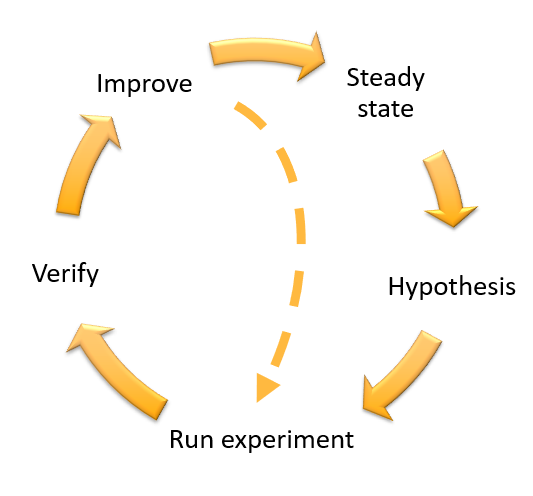
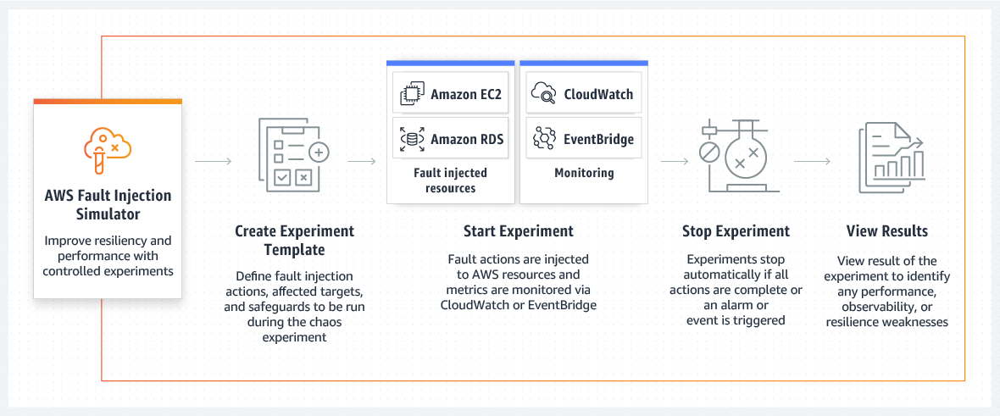
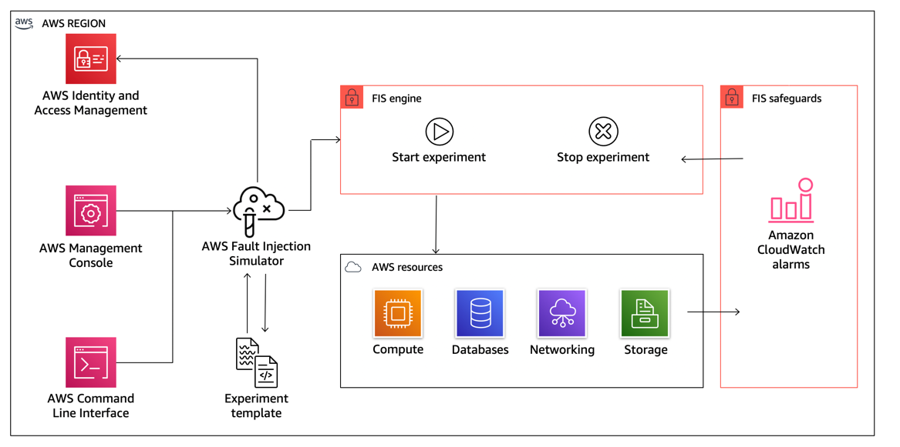

# Reliability
In statistics and psychometrics, reliability is the overall consistency of a measure. A measure is said to have a high reliability if it produces similar results under consistent conditions.

# Chaos Engineering
## Why Chaos Engineering
There are many reasons to do chaos engineering. We see teams transitioning in this way to reduce incidents, lower downtime costs, train their teams, and prepare for critical moments. Practicing chaos engineering allows you to detect problems before they become accidents and before customers are affected. And chaos engineering is useful for reducing downtime costs because it allows teams to have a resilient architecture. While the number of companies operating at Internet scale increases and high-traffic events such as sales or launches increase, the cost of downtime will become more expensive. Additionally, this continuous practice of chaos engineering gives teams more confidence every day as they build their own applications and systems. It takes less time to fire-fighting and more time to create and create value.

## How to do Chaos Engineering
To implement Chaos Engineering, one should follow the scientific method to implement experiments:
1. Observe your system
1. Baseline your metrics
1. Define Steady State
1. Form a Hypothesis with Abort Conditions (Blast Radius)
1. Run Experiment
1. Analyze Results
1. Expand Scope and Re-Test
1. Share Results



# AWS Fault Injection Simulator (FIS)
[AWS Fault Injection Simulator](https://aws.amazon.com/fis/) is a fully managed service for running fault injection experiments on AWS that makes it easier to improve an application’s performance, observability, and resiliency. Fault injection experiments are used in chaos engineering, which is the practice of stressing an application in testing or production environments by creating disruptive events, such as sudden increase in CPU or memory consumption, observing how the system responds, and implementing improvements. For more details, please visit [what is](https://docs.aws.amazon.com/fis/latest/userguide/what-is.html) page.




## Getting started
### AWS CLI
:warning: **This module requires the aws cli version 2.5.8 or higher**

Follow the official guide to install and configure profiles.
- [AWS CLI Installation](https://docs.aws.amazon.com/cli/latest/userguide/cli-chap-install.html)
- [AWS CLI Configuration](https://docs.aws.amazon.com/cli/latest/userguide/cli-configure-profiles.html)

After the installation is complete, you can check the aws cli version:
```
aws --version
aws-cli/2.5.8 Python/3.9.11 Darwin/21.4.0 exe/x86_64 prompt/off
```

### Terraform
Terraform is an open-source infrastructure as code software tool that enables you to safely and predictably create, change, and improve infrastructure.

#### Install
This is the official guide for terraform binary installation. Please visit this [Install Terraform](https://learn.hashicorp.com/tutorials/terraform/install-cli) website and follow the instructions.

Or, you can manually get a specific version of terraform binary from the websiate. Move to the [Downloads](https://www.terraform.io/downloads.html) page and look for the appropriate package for your system. Download the selected zip archive package. Unzip and install terraform by navigating to a directory included in your system's `PATH`.

Or, you can use [tfenv](https://github.com/tfutils/tfenv) utility. It is very useful and easy solution to install and switch the multiple versions of terraform-cli.

First, install tfenv using brew.
```
brew install tfenv
```
Then, you can use tfenv in your workspace like below.
```
tfenv install <version>
tfenv use <version>
```
Also this tool is helpful to upgrade terraform v0.12. It is a major release focused on configuration language improvements and thus includes some changes that you'll need to consider when upgrading. But the version 0.11 and 0.12 are very different. So if some codes are written in older version and others are in 0.12 it would be great for us to have nice tool to support quick switching of version.
```
tfenv list
tfenv install latest
tfenv use <version>
```

# Experiments
- [AWS FIS Blueprint](https://github.com/Young-ook/terraform-aws-fis/tree/main/examples/blueprint)
- [Amazon EC2](https://github.com/Young-ook/terraform-aws-fis/blob/main/examples/ec2)
- [Amazon EKS](https://github.com/Young-ook/terraform-aws-fis/blob/main/examples/eks)
- [Amazon RDS](https://github.com/Young-ook/terraform-aws-fis/blob/main/examples/rds)
- [Amazon ElastiCache for Redis](https://github.com/Young-ook/terraform-aws-fis/blob/main/examples/redis)
- [Application Modernization with Spinnaker](https://github.com/Young-ook/terraform-aws-spinnaker/tree/main/examples/aws-modernization-with-spinnaker)

# Known Issues
## Unknown parameter
You might see error like belows if your aws cli does not support log configuration parameter of aws fis command. Upgrade your aws cli when you see that. This module requires aws cli version 2.5.8 or higher.
```
module.awsfis.null_resource.awsfis-init (local-exec): Parameter validation failed:
module.awsfis.null_resource.awsfis-init (local-exec): Unknown parameter in input: "logConfiguration", must be one of: clientToken, description, stopConditions, targets, actions, roleArn, tags
```

# Additional Resources
## Amazon Route 53 Application Recovery Controller
- [Introducing Amazon Route 53 Application Recovery Controller](https://aws.amazon.com/blogs/aws/amazon-route-53-application-recovery-controller/)
- [Building highly resilient applications using Amazon Route 53 Application Recovery Controller, Part 1: Single-Region stack](https://aws.amazon.com/blogs/networking-and-content-delivery/building-highly-resilient-applications-using-amazon-route-53-application-recovery-controller-part-1-single-region-stack/)
- [Building highly resilient applications using Amazon Route 53 Application Recovery Controller, Part 2: Multi-Region stack](https://aws.amazon.com/blogs/networking-and-content-delivery/building-highly-resilient-applications-using-amazon-route-53-application-recovery-controller-part-2-multi-region-stack/)

## AWS Fault Injection Simulator
- [AWS Fault Injection Simulator - Use controlled experiments to boost resilience](https://aws.amazon.com/blogs/aws/aws-fault-injection-simulator-use-controlled-experiments-to-boost-resilience/)

## AWS Resilience Hub
- [How to use Resilience Hub’s Fault Injection Experiments to test application’s resilience](https://aws.amazon.com/blogs/mt/how-to-use-resiliency-hubs-fault-injection-experiments-to-test-applications-resilience/)
- [Manage Application Resilience with AWS Resilience Hub, Part 1](https://youtu.be/Hp9waMg2258)
- [Manage Application Resilience with AWS Resilience Hub, Part 2](https://youtu.be/NTvtkWlosjo)
- [Manage Cross-Account Resources in AWS Resilience Hub](https://youtu.be/HU26PSkcIr4)
- [Using AWS Resilience Hub with Microservices](https://youtu.be/oWCzzYLGLoY)

## Chaos Engineering
- [Chaos Engineering (카오스 엔지니어링)](https://youngookkim.tistory.com/48)
- [Yahoo Japan Chaos Engineering Practices in Production Environments](https://speakerdeck.com/techverse_2022/yahoo-japan-practices-chaos-engineering-in-production-environments)

## Disaster Recovery
- [Disaster Recovery of Workloads on AWS](https://youtu.be/cJZw5mrxryA)
- [Disaster Recovery of Workloads on AWS: Recovery in the Cloud](https://docs.aws.amazon.com/whitepapers/latest/disaster-recovery-workloads-on-aws/disaster-recovery-workloads-on-aws.html)
- [Disaster Recovery of On-Premises Application to AWS](https://docs.aws.amazon.com/whitepapers/latest/disaster-recovery-of-on-premises-applications-to-aws/abstract-and-introduction.html)
