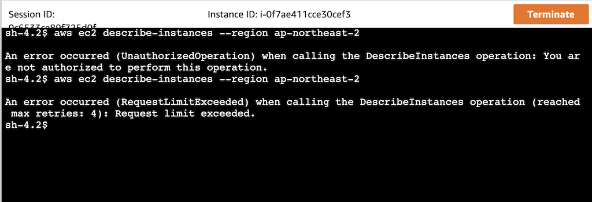

[[English](README.md)] [[한국어](README.ko.md)]

# FIS Blueprint
This is FIS (AWS Fault Injection Simulator) Blueprint example helps you compose complete FIS experiments that are fully bootstrapped with the operational software that is needed to deploy and operate chaos engineering. Chaos engineering is the discipline of experimenting on a distributed system in order to build confidence in the system's capability to withstand turbulent and unexpected conditions in production. If you want know why and how to do chaos engineering, please refer to [this page](https://github.com/Young-ook/terraform-aws-fis/tree/main/README.md). With this FIS Blueprint example, you describe the configuration for the desired state of your fault-tolerant AWS environment and resilience testing tools, such as the control plane, computing nodes, databases, storage, network and fault injection simulator, as an Infrastructure as Code (IaC) template/blueprint. Once a blueprint is configured, you can use it to stamp out consistent environments across multiple AWS accounts and Regions using your automation workflow tool, such as Jenkins, CodePipeline. Also, you can use FIS Blueprint to easily bootstrap a reliable cloud-native application stack with confidence. FIS Blueprints also helps you implement relevant security controls needed to operate workloads from multiple teams.

## Setup
### Download
Download this example on your workspace
```
git clone https://github.com/Young-ook/terraform-aws-fis
cd terraform-aws-fis/examples/blueprint
```

Then you are in **blueprint** directory under your current workspace. There is an exmaple includes a terraform configuration to create and manage an EKS cluster and Addon utilities on your AWS account. Please make sure you have the terraform and kubernetes tools in your environment, or go to the [eks project page](https://github.com/Young-ook/terraform-aws-eks) and follow the installation instructions before you move to the next step.
All things are ready, apply terraform:
```
terraform init
terraform apply
```
Also you can use the *-var-file* option for customized paramters when you run the terraform plan/apply command.
```
terraform plan -var-file fixture.tc1.tfvars
terraform apply -var-file fixture.tc1.tfvars
```

### Update kubeconfig
We need to get kubernetes config file for access the cluster that we've made using terraform. After terraform apply, you will see the bash command on the outputs. The terraform output should look similar to the one below. To update kubeconfig, simply, copy the bash command from the terraform output and run it on your workspace. Then export the downloaded file to **KUBECONFIG** environment variable. For more details, please refer to the [user guide](https://github.com/Young-ook/terraform-aws-eks#generate-kubernetes-config).
```
bash -e .terraform/modules/eks/script/update-kubeconfig.sh -r ap-northeast-2 -n fis-blueprint -k kubeconfig
export KUBECONFIG=kubeconfig
```

### Access Chaos Mesh
[Chaos Mesh](https://chaos-mesh.org/docs/) is an open source cloud-native Chaos Engineering platform. It offers various types of fault simulation and has an enormous capability to orchestrate fault scenarios. Using Chaos Mesh, you can conveniently simulate various abnormalities that might occur in reality during the development, testing, and production environments and find potential problems in the system. AWS FIS supports ChaosMesh and Litmus experiments for containerized applications running on Amazon Elastic Kubernetes Service (EKS). Using the new Kubernetes custom resource action for AWS FIS, you can control ChaosMesh and Litmus chaos experiments from within an AWS FIS experiment, enabling you to coordinate fault injection workflows among multiple tools. For example, you can run a stress test on a pod’s CPU using ChaosMesh or Litmus faults while terminating a randomly selected percentage of cluster nodes using AWS FIS fault actions.

In your local workspace, run kubernetes command to connect to your chaos-mesh dashboard through a proxy:
```
kubectl -n chaos-mesh port-forward svc/chaos-dashboard 2333:2333
```
If you are run this example in your Cloud9 IDE, you have to change the local port to 8080 instead of 2333.
```
kubectl -n chaos-mesh port-forward svc/chaos-dashboard 8080:2333
```
Open `http://localhost:2333` on your web browser. If you are in your Cloud9 IDE, click *Preview* and *Preview Running Application*. This shows chaos mesh dashboard login page. When you access your chaos mesh dashboard, first, you have to create user accounts and bind permissions. Follow the [Manage User Permissions](https://chaos-mesh.org/docs/manage-user-permissions/) instructions to create a new user and generate access token.


### Allow AWS FIS to call chaos mesh manager
First, to use AWS FIS as a centralized fault injection manager that leverages chaos mesh to inject faults into kubernetes resources, you have to create a chaos-mesh-manager RBAC role in your Kubernetes cluster. Next, you need to integrate using the aws-auth config map in the kube-system namespace.

This is kubernetes command to create chaos-mesh-manager role:
```
kubectl apply -f cm-manager.yaml
```

Then, check the aws-auth configmap:
```
kubectl -n kube-system describe cm aws-auth
```

The chaos mesh manager Kubernetes RBAC Role and the AWS FIS IAM Role must be integrated as shown below.
```
auth
Name:         aws-auth
Namespace:    kube-system
Labels:       <none>
Annotations:  <none>

Data
====
mapAccounts:
----
[]

mapRoles:
----
- "groups":
  - "system:bootstrappers"
  - "system:nodes"
  "rolearn": "arn:aws:iam::111100001234:role/fis-blueprint-kubernetes-ng"
  "username": "system:node:{{EC2PrivateDNSName}}"
- "groups":
  - "system:masters"
  - "chaos-mesh-manager-role"
  "rolearn": "arn:aws:iam::111100001234:role/fis-blueprint-fis-run"
```

## Applications
- [LAMP](./apps/README.md#lamp)
- [Redispy](./apps/README.md#redispy)
- [SockShop](./apps/README.md#sockshop)
- [Yelb](./apps/README.md#yelb)

## Expreiments
### Elastic Kubernetes Service (EKS)
#### Terminate Kubernetes Pod(s)


### Elastic Cloud Compute (EC2)
#### Run Load Generator

**Script**
Terraform configuration also creates a load generator for your application instances. This load generator instance runs a load generator script that repeatedly sends http requests to the application load balancer. Before you begin the first chaos engineering experiment, you must run the load generator script. 1) Access your load generator (blazemeter ec2 instance) via session manager of aws systems manager service. If you don't know how to access a ec2 instance through session manager, please refer to this [guide](https://github.com/Young-ook/terraform-aws-ssm/blob/main/README.md#connect) 2) Create a *loadgen.sh* file with bash script example shown as below into home direcotry of *ssm-user* (/home/ssm-user) after terraform apply.
```
#!/bin/bash
while true; do
  curl -I http://fis-blueprint-ec2-a.corp.internal
  sleep .5
done
```

This step is very important because it warms up the instances for cloudwatch metrics. After few minutes, all cloudwatch alarms will be chaged to *OK* status from *Insufficient data* in minutes after the load generator script running. Run the script for load test:
```
./loadgen.sh
```

**BlazeMeter**
Taurus is an open-source test automation framework providing simple yaml based configuration format with DSL (domain specific language). Is also extends and abstracts the functionality of leading open-source testing tools executoers such as JMeter, Gatling, Locust, and more. For more details about blazemeter taurus module, please refert to the [module guide](https://github.com/Young-ook/terraform-aws-fis/blob/main/modules/bzt/README.md). In this blueprint, blazemeter tool and test suite will be installed automatically on your loadgen ec2 instance. After up and running of loadgen instance, access on via session manager. If you don't know how to access a ec2 instance through session manager, please please follow the [instructions](https://github.com/Young-ook/terraform-aws-ssm/blob/main/README.md#connect).

Move to the *ssm-user* home directory (/home/ssm-user) and run blazemeter:
```
bzt /opt/bzt/config.yaml
```


#### Terminate EC2 Instance(s)
AWS FIS allows you to test resilience based on ec2 autoscaling group. See what happens when you terminate some ec2 instances in a specific availability zone. This test will check if the autoscaling group launches new instances to meet the desired capacity defined. Use this test to verify that the autoscaling group overcomes the single availability zone failure.

##### Define Steady State
First of all, we need to define steady state of the service. This means the service is healthy and working well. We use ‘p90’ to refer to the 90th percentile data; that is, 90% of the observations fall below this value. Percentiles for p90, p95, p99, p99.9, p99.99 or any other percentile from 0.1 to 100 in increments of 0.1% (including p100) of request metric can now be visualized in near real time. We will use this alarm for stop condition of fault injection experiment.

**Steady State Hypothesis Example**
+ Title: Services are all available and healthy
+ Type: What are your assumptions?
   - [ ] No Impact
   - [ ] Degraded Performance
   - [ ] Service Outage
   - [ ] Impproved Performance
+ Probes:
   - Type: CloudWatch Metric
   - Status: `p90`
+ Stop condition (Abort condition):
   - Type: CloudWatch Alarm
   - Status: `p90`
+ Results:
   - What did you see?
+ Conclusions:
   - [ ] Everything is as expected
   - [ ] Detected something
   - [ ] Handleable error has occurred
   - [ ] Need to automate
   - [ ] Need to dig deeper

##### Stop Condition
This is a very important feature for reducing customer impact during chaotic engineering of production systems. Some experiments have a lot of impact on customers during fault injection. If the application goes wrong, the experiment must be stopped autumatically.

##### Run Experiment
This scenario will simulate an accidental ec2 instance termination.

##### Improvement
What did you see?

#### Throttling AWS API
##### Define Steady State
First of all, we need to define steady state of the service. This means the service is healthy and working well. We use ‘p90’ to refer to the 90th percentile data; that is, 90% of the observations fall below this value. Percentiles for p90, p95, p99, p99.9, p99.99 or any other percentile from 0.1 to 100 in increments of 0.1% (including p100) of request metric can now be visualized in near real time. We will use this alarm for stop condition of fault injection experiment.

**Steady State Hypothesis Example**
+ Title: Services are all available and healthy
+ Type: What are your assumptions?
   - [ ] No Impact
   - [ ] Degraded Performance
   - [ ] Service Outage
   - [ ] Impproved Performance
+ Probes:
   - Type: CloudWatch Metric
   - Status: `p90`
+ Stop condition (Abort condition):
   - Type: CloudWatch Alarm
   - Status: `p90`
+ Results:
   - What did you see?
+ Conclusions:
   - [ ] Everything is as expected
   - [ ] Detected something
   - [ ] Handleable error has occurred
   - [ ] Need to automate
   - [ ] Need to dig deeper

##### Stop Condition
This is a very important feature for reducing customer impact during chaotic engineering of production systems. Some experiments have a lot of impact on customers during fault injection. If the application goes wrong, the experiment must be stopped autumatically.

##### Run Experiment
This scenario will simulate an accidental AWS API throttling event when your ec2 instance is trying to describe other instances. When running this experiment, you can see the throttling error when you call the AWS APIs (e.g., DescribeInstances). Follows the instructions shown as below to run throttling experiment.

1. Move on the EC2 service page. Press the *Instances (running)* to switch the screen to show the list of running instances.
1. Select a ec2 instance of autoscaling group that you created by this module. Maybe its name looks like *fis-blueprint-ec2-a-canary*.
1. Click *Connect* button and choose *Session* tab to access the instance using AWS Session Manager. And finally press the orange *Connect* button and go.
1. You are in the instance, run aws command-line interface (cli) to describe instances where region you are in.
1. First try, you will see *Unauthorized* error.
1. Back to the FIS page, Select *ThrottleAwsAPIs* template in the experiment templates list. Click the *Actions* and *Start experiment* button to start a new chaos experiment.
1. Then you will see the changed error message when you run the same aws cli. The error message is API Throttling.

##### Improvement
What did you see? Following screenshot shows how it works. First line shows the request and reponse about ec2-describe-instances api using AWS CLI. The error message is *Unauthorized* because the target role the instance has does not have right permission to describe instances. And second line is the reponse of the same AWS API call when throttling event is running. You will find out that the error message has been changed becuase of fault injection experiment.



## Clean up
Run terraform:
```
terraform destroy
```
**[DON'T FORGET]** You have to use the *-var-file* option when you run terraform destroy command to delete the aws resources created with extra variable files.
```
terraform destroy -var-file fixture.tc1.tfvars
```

# Additional Resources
## AWS Fault Injection Simulator
- [Chaos Testing with AWS Fault Injection Simulator and AWS CodePipeline](https://aws.amazon.com/blogs/architecture/chaos-testing-with-aws-fault-injection-simulator-and-aws-codepipeline/)
- [Increase your e-commerce website reliability using chaos engineering and AWS Fault Injection Simulator](https://aws.amazon.com/blogs/devops/increase-e-commerce-reliability-using-chaos-engineering-with-aws-fault-injection-simulator/)

## Chaos Mesh
- [Simulate Kubernetes Resource Stress Test](https://chaos-mesh.org/docs/simulate-heavy-stress-on-kubernetes/) 
- [Simulate AWS Faults](https://chaos-mesh.org/docs/simulate-aws-chaos/)

## Terraform Modules
- [Terraform module: Amazon Aurora](https://github.com/Young-ook/terraform-aws-aurora)
- [Terraform module: Amazon EKS](https://github.com/Young-ook/terraform-aws-eks)
- [Terraform module: AWS Systems Manager](https://github.com/Young-ook/terraform-aws-ssm)
- [Terraform module: Spinnaker](https://github.com/Young-ook/terraform-aws-spinnaker)
