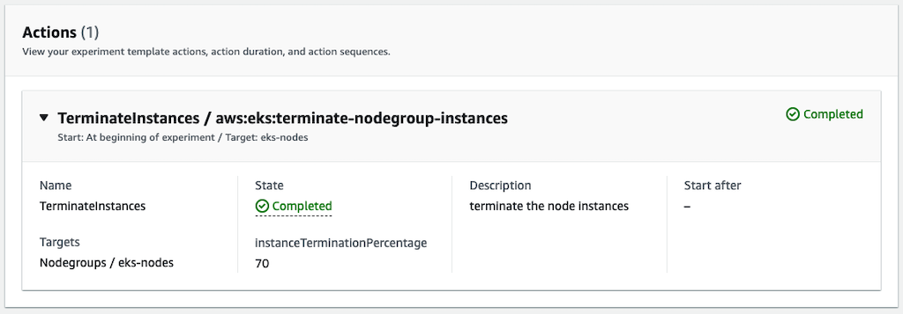
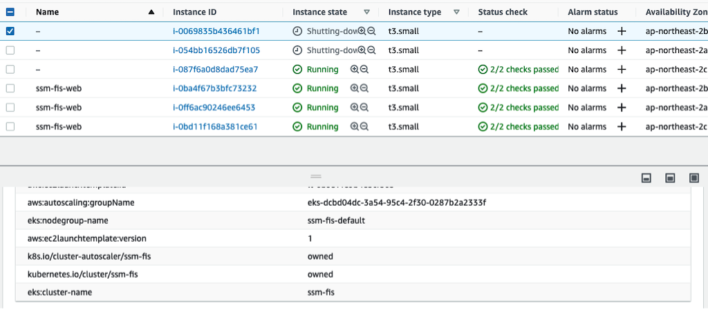

[[English](README.md)] [[한국어](README.ko.md)]

# FIS Blueprint
This is FIS (AWS Fault Injection Simulator) Blueprint example helps you compose complete FIS experiments that are fully bootstrapped with the operational software that is needed to deploy and operate chaos engineering. Chaos engineering is the discipline of experimenting on a distributed system in order to build confidence in the system's capability to withstand turbulent and unexpected conditions in production. If you want know why and how to do chaos engineering, please refer to [this page](https://github.com/Young-ook/terraform-aws-fis/tree/main/README.md). With this FIS Blueprint example, you describe the configuration for the desired state of your fault-tolerant AWS environment and resilience testing tools, such as the control plane, computing nodes, databases, storage, network and fault injection simulator, as an Infrastructure as Code (IaC) template/blueprint. Once a blueprint is configured, you can use it to stamp out consistent environments across multiple AWS accounts and Regions using your automation workflow tool, such as Jenkins, CodePipeline. Also, you can use FIS Blueprint to easily bootstrap a reliable cloud-native application stack with confidence. FIS Blueprints also helps you implement relevant security controls needed to operate workloads from multiple teams.

## Setup
### Prerequisites
This module requires *eksctl* which is an open-source cli tool for EKS cluster management. In this example, we will use *eksctl* to create kubernetes access control objects for FIS integration. Follow the [instructions](https://github.com/weaveworks/eksctl#installation) for eksctl installation. And if you don't have the terraform and kubernetes tools in your environment, go to the [install guide](https://github.com/Young-ook/terraform-aws-eks) and follow the instructions.

:warning: **This example requires the eksctl version 0.135.0 or higher**

### Download
Download this example on your workspace
```
git clone https://github.com/Young-ook/terraform-aws-fis
cd terraform-aws-fis/examples/blueprint
```

Then you are in **blueprint** directory under your current workspace. There is an exmaple includes a terraform configuration to create and manage an EKS cluster and Addon utilities on your AWS account. Please make sure you have the terraform and kubernetes tools in your environment, or go to the [eks project page](https://github.com/Young-ook/terraform-aws-eks) and follow the installation instructions before you move to the next step.
All things are ready, apply terraform:
```
terraform init
terraform apply
```
Also you can use the *-var-file* option for customized paramters when you run the terraform plan/apply command.
```
terraform plan -var-file fixture.tc1.tfvars
terraform apply -var-file fixture.tc1.tfvars
```

### Update kubeconfig
We need to get kubernetes config file for access the cluster that we've made using terraform. After terraform apply, you will see the bash command on the outputs. The terraform output should look similar to the one below. To update kubeconfig, simply, copy the bash command from the terraform output and run it on your workspace. Then export the downloaded file to **KUBECONFIG** environment variable. For more details, please refer to the [user guide](https://github.com/Young-ook/terraform-aws-eks#generate-kubernetes-config).
```
bash -e .terraform/modules/eks/script/update-kubeconfig.sh -r ap-northeast-2 -n fis-blueprint -k kubeconfig
export KUBECONFIG=kubeconfig
```

## Applications
- [LAMP](./apps/README.md#lamp)
- [Redispy](./apps/README.md#redispy)
- [SockShop](./apps/README.md#sockshop)
- [Yelb](./apps/README.md#yelb)

## Expreiments
### Elastic Kubernetes Service (EKS)
#### Microservices Architecture Application
For this lab, we picked up the [SockShop](./apps/README.md#sockshop) application. This is a sample application that Weaveworks initially developed for learning and demonstration purposes. Make sure that your sockshop microservices architecture application is running on your EKS cluster before you move to the next stage.

#### Terminate EKS Nodes
AWS FIS allows you to test resiliency of EKS cluster node groups. See what happens if you shut down some ec2 nodes for kubernetes pods or services within a certain percentage. This test verifies that the EKS managed node group launches new instances to meet the defined desired capacity and ensures that the application containers continues to run well. Also, this test will help you understand what happens to your application when you upgrade your cluster. At this time, in order to satisfy both resiliency and ease of cluster upgrade, the container should be designed so that it can be moved easily. This makes it easy to move containers running on the failed node to another node to continue working. This is an important part of a cloud-native architecture.

##### Define Steady State
Before we begin a failure experiment, we need to validate the user experience and revise the dashboard and metrics to understand that the systems are working under normal state, in other words, steady state.


Let’s go ahead and explore Sock Shop application. Some things to try out:
1. Register and log in using the below credentials (These are very secure so please don’t share them)
    * Username: `user`
    * Password: `password`
1. View various items
1. Add items to cart
1. Remove items from cart
1. Check out items

##### Hypothesis
The experiment we’ll run is to verify and fine-tune our application availability when compute nodes are terminated accidentally. The application is deployed as a container on the Kubernetes cluster, we assume that if some nodes are teminated, the Kubernetes control plane will reschedule the pods to the other healthy nodes. In order for chaos engineering to follow the scientific method, we need to start by making hypotheses. To help with this, you can use an experiment chart (see below) in your experiment design. We encourage you to take at least 5 minutes to write your experiment plan.

**Steady State Hypothesis Example**

+ Title: Services are all available and healthy
+ Type: What are your assumptions?
   - [ ] No Impact
   - [ ] Degraded Performance
   - [ ] Service Outage
   - [ ] Impproved Performance
+ Probes:
   - Type: CloudWatch Metric
   - Status: `service_number_of_running_pods` is greater than 0
+ Stop condition (Abort condition):
   - Type: CloudWatch Alarm
   - Status: `service_number_of_running_pods` is less than 1
+ Results:
   - What did you see?
+ Conclusions:
   - [ ] Everything is as expected
   - [ ] Detected something
   - [ ] Handleable error has occurred
   - [ ] Need to automate
   - [ ] Need to dig deeper

##### Run Experiment
Make sure that all your EKS node group instances are running. Go to the AWS FIS service page and select `TerminateEKSNodes` from the list of experiment templates. Then use the on-screen `Actions` button to start the experiment. AWS FIS shuts down EKS nodes for up to 70% of currently running instances. In this experiment, this value is 40% and it is configured in the experiment template. You can edit this value in the target selection mode configuration if you want to change the number of EKS nodes to shut down You can see the terminated instances on the EC2 service page, and the new instances will appear shortly after the EKS node is shut down.




You can see the nodes being shut down in the cluster:
```
kubectl -n sockshop get node -w
NAME                                            STATUS   ROLES    AGE     VERSION
ip-10-1-1-205.ap-northeast-2.compute.internal   Ready    <none>   21m     v1.20.4-eks-6b7464
ip-10-1-9-221.ap-northeast-2.compute.internal   Ready    <none>   4m40s   v1.20.4-eks-6b7464
ip-10-1-9-221.ap-northeast-2.compute.internal   NotReady   <none>   4m40s   v1.20.4-eks-6b7464
ip-10-1-9-221.ap-northeast-2.compute.internal   NotReady   <none>   4m40s   v1.20.4-eks-6b7464
```

##### Discussion
Then access the microservices application again. What happened? Perhaps a node shutdown by a fault injection experiment will cause the application to crash. But your application might be recovered immediatedly because of deployment configuration for high availability (stateless, immutable, replicable) characteristics against single node or availability-zone failure. Before we move to the next step, we need to think about one thing. In this experiment, business healthy state (steady state) is specified as cpu utilization and number of healthy pods. But after the first experiment, you will see the service does not work properly even though the monitoring indicators are in the normal range. It would be weird it is also meaningful. This result shows that unintended problems can occur even if the monitoring numbers are normal. It could be one of the experimental results that can be obtained through chaos engineering.

Go forward.

##### Architecture Improvements
Cluster Autoscaler is a tool that automatically adjusts the size of the Kubernetes cluster when one of the following conditions is true:
+ there are pods that failed to run in the cluster due to insufficient resources.
+ there are nodes in the cluster that have been underutilized for an extended period of time and their pods can be placed on other existing nodes.

Cluster Autoscaler provides integration with Auto Scaling groups. Cluster Autoscaler will attempt to determine the CPU, memory, and GPU resources provided by an EC2 Auto Scaling Group based on the instance type specified in its Launch Configuration or Launch Template. Click [here](https://github.com/kubernetes/autoscaler/tree/master/cluster-autoscaler/cloudprovider/aws) for more information.

Watch the logs to verify cluster autoscaler is installed properly. If everything looks good, we are now ready to scale our cluster.
```
kubectl -n kube-system logs -f deployment/cluster-autoscaler
```

And check your pods that has been applied *pod-anti-affinity* policy for high availability.


##### Rerun Experiment
Back to the AWS FIS service page, and rerun the terminate eks nodes experiment against the target to ensure that the microservices application is working in the previously assumed steady state.


#### Terminate Kubernetes Pod(s)


#### Stress on Pod(s)
AWS FIS allows you to test resiliency of kubernetes podskubernetes pods. See what happens on your application when your pods has very high CPU utilization. With this disk stress experiment, also you can test if the alarm fires when there is not enough space on the compute node to write files, such as log files. This test verifies that you have set up an alarm to be raised when the disk utilization metric is greater than a threshold. See what happens to your application when the disk file system utilization on the EKS node (ec2 instance) is very high.

##### Define Steady State
Before we begin a failure experiment, we need to validate the user experience and business operations, system status are working under normal state, in other words, steady state. The goal of this experiment is to verify that the system automatically react to increas computing resources when requests increases or disk usage alarm works well when disk usage increases.

##### Hypothesis
The experiment we’ll run is to verify and fine-tune our application reliability when compute nodes becomes busy.

##### Run Experiment
Make sure that all your EKS node group instances are running. Go to the AWS FIS service page and select `eks-stress` from the list of experiment templates. Then use the on-screen `Actions` button to start the experiment. In this experiment, AWS FIS increases CPU utilization for half of the EC2 instances with the chaos=ready tag. You can change the target percentage of an experiment in the experiment template. To change the number of EKS nodes to which the CPU stress experiment will be applied, edit the filter or tag values in the target selection mode configuration in the template. After starting the experiment, you can see the CPU utilization and Disk filesystem utilization increases on the EC2 service page or the CloudWatch service page.


##### Discussion
What happened? What did you see? Was your application working well while the fault inejction experiment was running. Discuss what went well and what did not work and why.

### Elastic Cloud Compute (EC2)
#### Run Load Generator

##### Script
Terraform configuration also creates a load generator for your application instances. This load generator instance runs a load generator script that repeatedly sends http requests to the application load balancer. Before you begin the first chaos engineering experiment, you must run the load generator script. 1) Access your load generator (blazemeter ec2 instance) via session manager of aws systems manager service. If you don't know how to access a ec2 instance through session manager, please refer to this [guide](https://github.com/Young-ook/terraform-aws-ssm/blob/main/README.md#connect) 2) Create a *loadgen.sh* file with bash script example shown as below into home direcotry of *ssm-user* (/home/ssm-user) after terraform apply.
```
#!/bin/bash
while true; do
  curl -I http://fis-blueprint-ec2-a.corp.internal
  sleep .5
done
```

This step is very important because it warms up the instances for cloudwatch metrics. After few minutes, all cloudwatch alarms will be chaged to *OK* status from *Insufficient data* in minutes after the load generator script running. Run the script for load test:
```
./loadgen.sh
```

##### BlazeMeter
Taurus is an open-source test automation framework providing simple yaml based configuration format with DSL (domain specific language). Is also extends and abstracts the functionality of leading open-source testing tools executoers such as JMeter, Gatling, Locust, and more. For more details about blazemeter taurus module, please refert to the [module guide](https://github.com/Young-ook/terraform-aws-fis/blob/main/modules/bzt/README.md). In this blueprint, blazemeter tool and test suite will be installed automatically on your loadgen ec2 instance. After up and running of loadgen instance, access on via session manager. If you don't know how to access a ec2 instance through session manager, please please follow the [instructions](https://github.com/Young-ook/terraform-aws-ssm/blob/main/README.md#connect).

Move to the *ssm-user* home directory (/home/ssm-user) and run blazemeter:
```
bzt /opt/bzt/config.yaml
```


#### Terminate EC2 Instance(s)
AWS FIS allows you to test resilience based on ec2 autoscaling group. See what happens when you terminate some ec2 instances in a specific availability zone. This test will check if the autoscaling group launches new instances to meet the desired capacity defined. Use this test to verify that the autoscaling group overcomes the single availability zone failure.

##### Define Steady State
First of all, we need to define steady state of the service. This means the service is healthy and working well. We use ‘p90’ to refer to the 90th percentile data; that is, 90% of the observations fall below this value. Percentiles for p90, p95, p99, p99.9, p99.99 or any other percentile from 0.1 to 100 in increments of 0.1% (including p100) of request metric can now be visualized in near real time. We will use this alarm for stop condition of fault injection experiment.

**Steady State Hypothesis Example**
+ Title: Services are all available and healthy
+ Type: What are your assumptions?
   - [ ] No Impact
   - [ ] Degraded Performance
   - [ ] Service Outage
   - [ ] Impproved Performance
+ Probes:
   - Type: CloudWatch Metric
   - Status: `p90`
+ Stop condition (Abort condition):
   - Type: CloudWatch Alarm
   - Status: `p90`
+ Results:
   - What did you see?
+ Conclusions:
   - [ ] Everything is as expected
   - [ ] Detected something
   - [ ] Handleable error has occurred
   - [ ] Need to automate
   - [ ] Need to dig deeper

##### Stop Condition
This is a very important feature for reducing customer impact during chaotic engineering of production systems. Some experiments have a lot of impact on customers during fault injection. If the application goes wrong, the experiment must be stopped autumatically.

##### Run Experiment
This scenario will simulate an accidental ec2 instance termination.

##### Improvement
What did you see?

#### Throttling AWS API
##### Define Steady State
First of all, we need to define steady state of the service. This means the service is healthy and working well. We use ‘p90’ to refer to the 90th percentile data; that is, 90% of the observations fall below this value. Percentiles for p90, p95, p99, p99.9, p99.99 or any other percentile from 0.1 to 100 in increments of 0.1% (including p100) of request metric can now be visualized in near real time. We will use this alarm for stop condition of fault injection experiment.

**Steady State Hypothesis Example**
+ Title: Services are all available and healthy
+ Type: What are your assumptions?
   - [ ] No Impact
   - [ ] Degraded Performance
   - [ ] Service Outage
   - [ ] Impproved Performance
+ Probes:
   - Type: CloudWatch Metric
   - Status: `p90`
+ Stop condition (Abort condition):
   - Type: CloudWatch Alarm
   - Status: `p90`
+ Results:
   - What did you see?
+ Conclusions:
   - [ ] Everything is as expected
   - [ ] Detected something
   - [ ] Handleable error has occurred
   - [ ] Need to automate
   - [ ] Need to dig deeper

##### Stop Condition
This is a very important feature for reducing customer impact during chaotic engineering of production systems. Some experiments have a lot of impact on customers during fault injection. If the application goes wrong, the experiment must be stopped autumatically.

##### Run Experiment
This scenario will simulate an accidental AWS API throttling event when your ec2 instance is trying to describe other instances. When running this experiment, you can see the throttling error when you call the AWS APIs (e.g., DescribeInstances). Follows the instructions shown as below to run throttling experiment.

1. Move on the EC2 service page. Press the *Instances (running)* to switch the screen to show the list of running instances.
1. Select a ec2 instance of autoscaling group that you created by this module. Maybe its name looks like *fis-blueprint-ec2-a-canary*.
1. Click *Connect* button and choose *Session* tab to access the instance using AWS Session Manager. And finally press the orange *Connect* button and go.
1. You are in the instance, run aws command-line interface (cli) to describe instances where region you are in.
1. First try, you will see list of ec2 instances.
1. Back to the FIS page, Select *ThrottleAwsAPIs* template in the experiment templates list. Click the *Actions* and *Start experiment* button to start a new chaos experiment.
1. Then you will see the changed error message when you run the same aws cli. The error message is API Throttling.

##### Improvement
What did you see? Following screenshot is an example of experiment. First line shows the request and reponse about ec2-describe-instances API using AWS CLI. It is worked well. And second line is the reponse of the same AWS API call when throttling event is running. You will find out that the error message has been changed becuase of fault injection experiment.


#### AWS API internal error
##### Define Steady State
First of all, we need to define steady state of the service. This means the service is healthy and working well. We use ‘p90’ to refer to the 90th percentile data; that is, 90% of the observations fall below this value. Percentiles for p90, p95, p99, p99.9, p99.99 or any other percentile from 0.1 to 100 in increments of 0.1% (including p100) of request metric can now be visualized in near real time. We will use this alarm for stop condition of fault injection experiment.

**Steady State Hypothesis Example**
+ Title: Services are all available and healthy
+ Type: What are your assumptions?
   - [ ] No Impact
   - [ ] Degraded Performance
   - [ ] Service Outage
   - [ ] Impproved Performance
+ Probes:
   - Type: CloudWatch Metric
   - Status: `p90`
+ Stop condition (Abort condition):
   - Type: CloudWatch Alarm
   - Status: `p90`
+ Results:
   - What did you see?
+ Conclusions:
   - [ ] Everything is as expected
   - [ ] Detected something
   - [ ] Handleable error has occurred
   - [ ] Need to automate
   - [ ] Need to dig deeper

##### Stop Condition
This is a very important feature for reducing customer impact during chaotic engineering of production systems. Some experiments have a lot of impact on customers during fault injection. If the application goes wrong, the experiment must be stopped autumatically.

##### Run Experiment
This scenario will simulate an accidental AWS API throttling event when your ec2 instance is trying to describe other instances. When running this experiment, you can see the throttling error when you call the AWS APIs (e.g., DescribeInstances). Follows the instructions shown as below to run throttling experiment.

1. Move on the EC2 service page. Press the *Instances (running)* to switch the screen to show the list of running instances.
1. Select a ec2 instance of autoscaling group that you created by this module. Maybe its name looks like *fis-blueprint-ec2-a-canary*.
1. Click *Connect* button and choose *Session* tab to access the instance using AWS Session Manager. And finally press the orange *Connect* button and go.
1. You are in the instance, run aws command-line interface (cli) to describe instances where region you are in.
1. First try, you will see *Unauthorized* error.
1. Back to the FIS page, Select *AwsApiInternalError* template in the experiment templates list. Click the *Actions* and *Start experiment* button to start a new chaos experiment.
1. Then you will see the changed error message when you run the same aws cli.

##### Improvement
What did you see? Following screenshot is an example of experiment. First line shows the request and reponse about ec2-assign-private-ip-addresses API using AWS CLI. The error message is *Unauthorized* because the target role the instance has does not have right permission to describe instances. And second line is the reponse of the same AWS API call when throttling event is running. You will find out that the error message has been changed becuase of fault injection experiment.


#### EC2 disk full error
##### Define Steady State
##### Stop Condition
##### Run Experiment
##### Improvement


### Virtual Private Cloud (VPC)
#### Disrupt Connectivity
This experiment uses network access control lists (NACLs) to simulate network outage failures. You can find that this experiment action requires IAM permissions to manage NACLs. Refer to the [AWS FIS actions reference](https://docs.aws.amazon.com/fis/latest/userguide/fis-actions-reference.html#network-actions-reference). One thing to note from this experiment is that you cannot block network traffic between your workloads and AWS managed services such as the EKS control plane. The reason is that NACLs only block network traffic to and from the subnet, and connectivity between workloads and AWS managed network interfaces continues to function during network failure injections. During your experimentation, you may see that kubernetes pods can communicate with the EKS control plane, the kubernetes API.


##### Define Steady State
First of all, we need to define steady state of the service. This means the service is healthy and working well. We use ‘p90’ to refer to the 90th percentile data; that is, 90% of the observations fall below this value. Percentiles for p90, p95, p99, p99.9, p99.99 or any other percentile from 0.1 to 100 in increments of 0.1% (including p100) of request metric can now be visualized in near real time. We will use this alarm for stop condition of fault injection experiment.

**Steady State Hypothesis Example**
+ Title: Services are all available and healthy
+ Type: What are your assumptions?
   - [ ] No Impact
   - [ ] Degraded Performance
   - [ ] Service Outage
   - [ ] Impproved Performance
+ Probes:
   - Type: CloudWatch Metric
   - Status: `p90`
+ Stop condition (Abort condition):
   - Type: CloudWatch Alarm
   - Status: `p90`
+ Results:
   - What did you see?
+ Conclusions:
   - [ ] Everything is as expected
   - [ ] Detected something
   - [ ] Handleable error has occurred
   - [ ] Need to automate
   - [ ] Need to dig deeper

##### Stop Condition
This is a very important feature for reducing customer impact during chaotic engineering of production systems. Some experiments have a lot of impact on customers during fault injection. If the application goes wrong, the experiment must be stopped autumatically.

##### Run Experiment
This scenario simulates an accidental Availability Zone outage event during a busy workload. When running this experiment, you should see your application getting into an anomalous state on the target subnet. Take a look at your monitoring dashboard to see if your application and business are up. To run a network disconnection experiment, follow the instructions below.

##### Improvement
What did you see? Did your application work well without interruption? Repeat to run the experiments several times to gain confidence.

## Clean up
Run terraform:
```
terraform destroy
```
**[DON'T FORGET]** You have to use the *-var-file* option when you run terraform destroy command to delete the aws resources created with extra variable files.
```
terraform destroy -var-file fixture.tc1.tfvars
```

# Additional Resources
## Amazon Route 53 Application Recovery Controller
- [Introducing Amazon Route 53 Application Recovery Controller](https://aws.amazon.com/blogs/aws/amazon-route-53-application-recovery-controller/)
- [Building highly resilient applications using Amazon Route 53 Application Recovery Controller, Part 1: Single-Region stack](https://aws.amazon.com/blogs/networking-and-content-delivery/building-highly-resilient-applications-using-amazon-route-53-application-recovery-controller-part-1-single-region-stack/)
- [Building highly resilient applications using Amazon Route 53 Application Recovery Controller, Part 2: Multi-Region stack](https://aws.amazon.com/blogs/networking-and-content-delivery/building-highly-resilient-applications-using-amazon-route-53-application-recovery-controller-part-2-multi-region-stack/)

## AWS Resilience Hub

- [How to use Resilience Hub’s Fault Injection Experiments to test application’s resilience](https://aws.amazon.com/blogs/mt/how-to-use-resiliency-hubs-fault-injection-experiments-to-test-applications-resilience/)
- [Manage Application Resilience with AWS Resilience Hub, Part 1](https://youtu.be/Hp9waMg2258)
- [Manage Application Resilience with AWS Resilience Hub, Part 2](https://youtu.be/NTvtkWlosjo)
- [Manage Cross-Account Resources in AWS Resilience Hub](https://youtu.be/HU26PSkcIr4)
- [Using AWS Resilience Hub with Microservices](https://youtu.be/oWCzzYLGLoY)

## AWS Fault Injection Simulator
- [Chaos Testing with AWS Fault Injection Simulator and AWS CodePipeline](https://aws.amazon.com/blogs/architecture/chaos-testing-with-aws-fault-injection-simulator-and-aws-codepipeline/)
- [Increase your e-commerce website reliability using chaos engineering and AWS Fault Injection Simulator](https://aws.amazon.com/blogs/devops/increase-e-commerce-reliability-using-chaos-engineering-with-aws-fault-injection-simulator/)
- [AWS Fault Injection Simulator - Use controlled experiments to boost resilience](https://aws.amazon.com/blogs/aws/aws-fault-injection-simulator-use-controlled-experiments-to-boost-resilience/)
- [AWS Lambda: Resilience under the hood](https://aws.amazon.com/blogs/compute/aws-lambda-resilience-under-the-hood/)

## Chaos Mesh
- [Simulate Kubernetes Resource Stress Test](https://chaos-mesh.org/docs/simulate-heavy-stress-on-kubernetes/) 
- [Simulate AWS Faults](https://chaos-mesh.org/docs/simulate-aws-chaos/)

## Terraform Modules
- [Terraform module: Amazon Aurora](https://github.com/Young-ook/terraform-aws-aurora)
- [Terraform module: Amazon EKS](https://github.com/Young-ook/terraform-aws-eks)
- [Terraform module: AWS Systems Manager](https://github.com/Young-ook/terraform-aws-ssm)
- [Terraform module: Spinnaker](https://github.com/Young-ook/terraform-aws-spinnaker)
