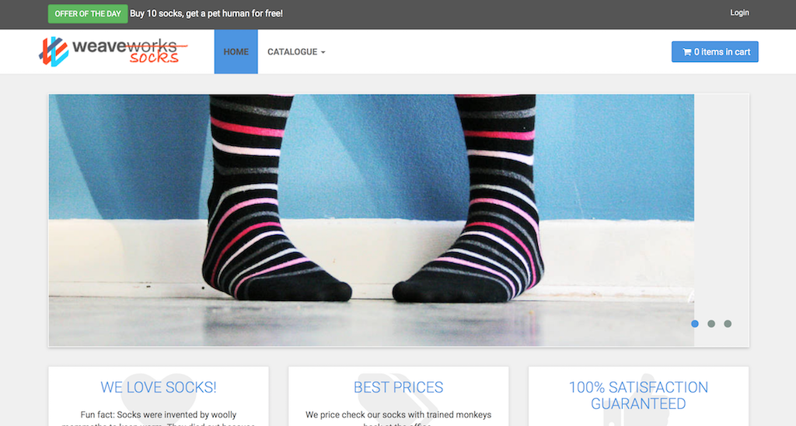

[[English](README.md)] [[한국어](README.ko.md)]

# Applications
## Yelb
Yelb is an example of simple restaurant voting app using Amazon EKS and AWS App Mesh. All application computing and data storage resources are deployed on a private network. And an App Mesh proxy (also known as a sidecar proxy in Service Mesh) is also deployed alongside the application container. And AWS X-ray is a tracing system for observing the communication topology of complex distributed systems. Here is the architecture.


### Deploy a service mesh example
Run kubectl from the workspace where you ran terraform:
```
kubectl apply -f apps/yelb/yelb.yaml
```

### Access the example
#### Local Workspace
In your local workspace, connect through a proxy to access your application's endpoint.
```
kubectl -n yelb port-forward svc/yelb-ui 8080:80
```
Open `http://localhost:8080` on your web browser. This shows the application main page.

#### Cloud9
In your Cloud9 IDE, run the application.
```
kubectl -n yelb port-forward svc/yelb-ui 8080:80
```

Click **Preview** > **Preview Running Application**. This opens up a preview tab and shows the application main page.


### Delete the application
Run kubectl:
```
kubectl delete -f apps/yelb/yelb.yaml
```

## Game 2048
You can run the sample application on a cluster. Deploy the game 2048 as a sample application to verify that the AWS load balancer controller creates an AWS ALB as a result of the Ingress object.
```
kubectl apply -f https://raw.githubusercontent.com/kubernetes-sigs/aws-load-balancer-controller/main/docs/examples/2048/2048_full.yaml
```

After a few minutes, verify that the Ingress resource was created with the following command. Describe ingress resource using kubectl. You will see the amazon resource name (ARN) of the generated application load balancer (ALB). Copy the address from output (e.g., k8s-game2048-ingress2-9e5ab32c61-1003956951.ap-northeast-2.elb.amazonaws.com) and open on the web browser.
```
kubectl -n game-2048 get ing
```

Output:
```
NAME           CLASS    HOSTS   ADDRESS                                                                        PORTS   AGE
ingress-2048   <none>   *       k8s-game2048-ingress2-9e5ab32c61-1003956951.ap-northeast-2.elb.amazonaws.com   80      29s
```


### Delete the application
Run kubectl:
```
kubectl delete -f https://raw.githubusercontent.com/kubernetes-sigs/aws-load-balancer-controller/main/docs/examples/2048/2048_full.yaml
```

## LAMP
In this lab, we use docker example with Apache, PHP, and Amazon Aurora (LAMP: Linux, Apache, MySQL, PHP) as an user application.

### Build an application
Run a build job to create a php-apache application container image. Copy the `build` command from the terraform output and run it:
```
bash -e .terraform/modules/ci/modules/codebuild/script/start-build.sh -r ap-northeast-2 -n arn:aws:codebuild:ap-northeast-2:111122223333:project/fis-rds-cxblf
```

### Deploy LAMP stack
Run containers:
```
kubectl apply -f apps/lamp/lamp.yaml
```

### Initialize a database
Get pod a name of mysql client and and start a interactive bash session with mysql client:
```
export MYSQL_CLIENT=$(kubectl get pods -n lamp -l name=mysql --template '{{range .items}}{{.metadata.name}}{{"\n"}}{{end}}')
kubectl -n lamp cp lamp/dump/mydb.sql $MYSQL_CLIENT:/
kubectl -n lamp exec -it $MYSQL_CLIENT -- bash
```

Inside the mysql container, enter the mysql cli command to access the Aurora cluster. Replace the {amazon-aurora-endpoint} with the terraform output value and enter the passwword when terminal propmted. The password is `supersecret`, it is not secure and is only used in this workshop.
```
mysql -h {amazon-aurora-endpoint} -u myuser -p mydb < mydb.sql
```

### Access an application
After installation and configuration is complete, start port-forwarding through the kubernetes proxy.
```
kubectl -n lamp port-forward svc/www 8080:80
```

Open `http://localhost:8080` on a web browser to look at a simple php example. Or if your are running this example in Cloud9, click **Preview** and **Preview Running Application**. This opens up a preview tab and shows the spinnaker application.


## Run Fault Injection Experiments
This module automatically creates fault injection simulator experiment templates on your AWS account. Move to the AWS FIS service page on the AWS Management Console and select Experiment templates menu on the left. Then you will see the created experiment templates for chaos engineering. To test your environment, select a experiment template that you want to run and click the `Actions` button on the right top on the screen. You will see `Start experiment` in the middle of poped up menu and select it. And follow the instructions.


### Failover DB Cluster
AWS FIS allows you to test resilience of Aurora DB cluster.

#### Define Steady State
Before we begin a failure experiment, we need to validate the user experience and revise the dashboard and metrics to understand that the systems are working under normal state, in other words, steady state.


### Delete the application
Delete all kubernetes resources.
```
kubectl apply -f apps/lamp/lamp.yaml
```

## Nginx
### Deploy Nginx from Public Registry
Copy below and **SAVE** as a new deployment file (nginx.yaml) on your workspace. You can edit the file if you have anything to change.
```
apiVersion: v1
kind: Service
metadata:
  name: my-nginx-svc
  labels:
    app: nginx
spec:
  ports:
  - port: 80
  selector:
    app: nginx
---
apiVersion: apps/v1
kind: Deployment
metadata:
  name: my-nginx
  labels:
    app: nginx
spec:
  replicas: 3
  selector:
    matchLabels:
      app: nginx
  template:
    metadata:
      labels:
        app: nginx
    spec:
      containers:
      - name: nginx
        image: nginx:1.14.2
        ports:
        - containerPort: 80
```
Then, apply the modified manifest.
```
kubectl apply -f nginx.yaml
```

To verify that the nginx pods are running properly on the multiple architecture node groups, run describe command.
```
kubectl describe no
```

The output will be shown below.
```
Name:               ip-172-xx-yx-xxx.us-west-2.compute.internal
                    beta.kubernetes.io/instance-type=m6g.medium
                    eks.amazonaws.com/nodegroup=eks-x86-arm64-tc2
                    kubernetes.io/arch=arm64
                    kubernetes.io/os=linux
CreationTimestamp:  Fri, 20 Nov 2020 12:52:26 +0900
System Info:
  Operating System:           linux
  Architecture:               arm64
  Container Runtime Version:  docker://19.3.6
  Kubelet Version:            v1.17.12-eks-xxxxyy
  Kube-Proxy Version:         v1.17.12-eks-xxxxyy
Non-terminated Pods:          (8 in total)
  Namespace                   Name                         CPU Requests  CPU Limits  Memory Requests  Memory Limits  AGE
  ---------                   ----                         ------------  ----------  ---------------  -------------  ---
  default                     my-nginx-xxxxyyyyww-bqpfk    0 (0%)        0 (0%)      0 (0%)           0 (0%)         3m2s
  default                     my-nginx-xxxxyyyyww-fzpfb    0 (0%)        0 (0%)      0 (0%)           0 (0%)         3m2s
  default                     my-nginx-xxxxyyyyww-kqht5    0 (0%)        0 (0%)      0 (0%)           0 (0%)         3m2s
  default                     my-nginx-xxxxyyyyww-m5x25    0 (0%)        0 (0%)      0 (0%)           0 (0%)         3m2s
  default                     my-nginx-xxxxyyyyww-tcv92    0 (0%)        0 (0%)      0 (0%)           0 (0%)         3m2s
Events:                       <none>
Name:               ip-172-xx-yy-xxx.us-west-2.compute.internal
                    beta.kubernetes.io/instance-type=m5.large
                    eks.amazonaws.com/nodegroup=eks-x86-arm64-tc2
                    kubernetes.io/arch=amd64
                    kubernetes.io/os=linux
CreationTimestamp:  Fri, 20 Nov 2020 12:52:59 +0900
System Info:
  Operating System:           linux
  Architecture:               amd64
  Container Runtime Version:  docker://19.3.6
  Kubelet Version:            v1.17.12-eks-xxxxyy
  Kube-Proxy Version:         v1.17.12-eks-xxxxyy
Non-terminated Pods:          (28 in total)
  Namespace                   Name                         CPU Requests  CPU Limits  Memory Requests  Memory Limits  AGE
  ---------                   ----                         ------------  ----------  ---------------  -------------  ---
  default                     my-nginx-xxxxyyyyww-5wlvd    0 (0%)        0 (0%)      0 (0%)           0 (0%)         3m2s
  default                     my-nginx-xxxxyyyyww-626nn    0 (0%)        0 (0%)      0 (0%)           0 (0%)         3m2s
  default                     my-nginx-xxxxyyyyww-6h7nk    0 (0%)        0 (0%)      0 (0%)           0 (0%)         3m2s
  default                     my-nginx-xxxxyyyyww-dgppf    0 (0%)        0 (0%)      0 (0%)           0 (0%)         3m2s
  default                     my-nginx-xxxxyyyyww-fgp8r    0 (0%)        0 (0%)      0 (0%)           0 (0%)         3m2s
Events:                       <none>
```

### Delete the application
Run kubectl:
```
kubectl delete -f nginx.yaml
```

## Hello Kubernetes
### Deploy Hello Kubernetes application
This is a simple example to show kubernetes information. Copy below and **SAVE** as a new deployment file (hellokube.yaml) on your workspace. You can edit the file if you have anything to change.
```
apiVersion: v1
kind: Service
metadata:
  name: hello-kubernetes
spec:
  ports:
  - port: 80
    targetPort: 8080
  selector:
    app: hello-kubernetes
---
apiVersion: apps/v1
kind: Deployment
metadata:
  name: hello-kubernetes
spec:
  replicas: 3
  selector:
    matchLabels:
      app: hello-kubernetes
  template:
    metadata:
      labels:
        app: hello-kubernetes
    spec:
      containers:
      - name: hello-kubernetes
        image: paulbouwer/hello-kubernetes:1.8
        ports:
        - containerPort: 8080
```
Then, apply the modified manifest.
```
kubectl apply -f hellokube.yaml
```

To check the status of node groups, run kubernetes cli command:
```
kubectl get no
```
```
NAME                 STATUS   ROLES    AGE     VERSION
fargate-10.0.2.59    Ready    <none>   109s    v1.17.9-eks-a84824
fargate-10.0.3.171   Ready    <none>   2m31s   v1.17.9-eks-a84824
fargate-10.0.3.80    Ready    <none>   2m49s   v1.17.9-eks-a84824
```
A few minutes later you can see the fargate/ec2 nodes are up. And you can try to access the service via port forwarding when all pods are ready and runnig. If everything looks fine, go forward to the next step.

### Access the example
#### Local Workspace
In your local workspace, connect through a proxy to access your application's endpoint.
```
kubectl port-forward svc/hello-kubernetes 8080:80
```
Open `http://localhost:8080` on your web browser. This shows the application main page.

#### Cloud9
In your Cloud9 IDE, run the application.
```
kubectl port-forward svc/hello-kubernetes 8080:80
```

### Delete the application
To clean up all resources or hello-kubernetes application from cluster, run kubectl:
```
kubectl delete -f hellokube.yaml
```

## Redispy
For this lab, we picked up the Redis rate-limit application which is a simple application made by redis lab for learning and demonstration purposes.

### Build an application
Run a build job to create a redis client application container image. Copy the `build` command from the terraform output and run it:
```
bash -e .terraform/modules/ci/modules/codebuild/script/start-build.sh -r ap-northeast-2 -n arn:aws:codebuild:ap-northeast-2:111122223333:project/fis-az-cxblf
```

### Deploy application
Create the namespace and deploy application.
```
kubectl apply -f apps/redispy/redispy.yaml
```
Verify that the pod came up fine (ensure nothing else is running on port 8080):
```
kubectl -n redispy get pod -l name=www
```
The output will be something like this:
```
NAME                   READY   STATUS    RESTARTS   AGE
www-59b86f6668-4sdr2   1/1     Running   0          43s
```

#### Local Workspace
In your local workspace, connect through a proxy to access your application's endpoint.
```
kubectl -n redispy port-forward svc/www 8080:8080
```
Open `http://localhost:8080` on your web browser. This shows the redis-rate-limit main page.

#### Cloud9
In your Cloud9 IDE, run the application.
```
kubectl -n redispy port-forward svc/www 8080:8080
```
Click **Preview** > **Preview Running Application**. This opens up a preview tab and shows the redis-rate-limit main page.


🎉 Congrats, you’ve deployed the sample application on your cluster.

### Delete the application
Delete all kubernetes resources.
```
kubectl delete -f apps/redispy/redispy.yaml
```

## SockShop
For this lab, we picked up the sockshop application. This is a microservices architecture sample application that Weaveworks initially developed. They made it open source so it can be used by other organizations for learning and demonstration purposes. This blueprint deploys your sockshop application to your EKS cluster using the local helm chart.

Verify that the pod came up fine (ensure nothing else is running on port 8079):
```
kubectl -n sockshop get pod -l name=front-end
```
The output will be something like this:
```
NAME                         READY   STATUS    RESTARTS   AGE
front-end-7b8bcd59cb-wd527   1/1     Running   0          9s
```

To access your sockshop application, check your application load balancer ingress using kubectl command:
```
kubectl -n sockshop get ing
```
You will see the dns name of your application load balancer. And open it on your web browser (Copy the dns name from your terminal disaply and paste it on your web browser window).



🎉 Congrats, you’ve deployed the sample application on your cluster.

### Run Load Generator
Run load generator inside kubernetes
```
kubectl apply -f apps/sockshop/sockshop-loadtest.yaml
```

### Stop and delete the load generator
Delete the load generator resources.
```
kubectl delete -f apps/sockshop/sockshop-loadtest.yaml
```

# Known Issues
## Dependency Violation
Make sure the game 2048 application is removed from the kubernetes cluster before deploying the infrastructure. If you skipped uninstalling the 2048 game in the previous step, you may see an error like the one below because terraform did not delete the application load balancer it created using the load balancer controller.
```
 Error: error deleting EC2 Subnet (subnet-001c9360b531a4a70): DependencyViolation: The subnet 'subnet-001c9360b531a4a70' has dependencies and cannot be deleted.
│ 	status code: 400, request id: f76a5dc7-0107-4847-a006-4c4e46be9720
╵
```
