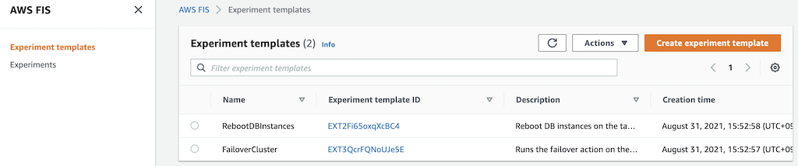

[[English](README.md)] [[한국어](README.ko.md)]

# Chaos Engineering
Chaos engineering is the discipline of experimenting on a distributed system in order to build confidence in the system's capability to withstand turbulent and unexpected conditions in production. If you want know why and how to do chaos engineering, please refer to this [page](https://github.com/Young-ook/terraform-aws-fis/blob/main/README.md).

## Download example
Download this example on your workspace
```sh
git clone https://github.com/Young-ook/terraform-aws-fis
cd terraform-aws-fis/examples/rds
```

## Setup
[This](https://github.com/Young-ook/terraform-aws-fis/blob/main/examples/rds/main.tf) is an example of terraform configuration file to create AWS Fault Injection Simulator experiments for chaos engineering. Check out and apply it using terraform command.

Run terraform:
```
terraform init
terraform apply
```
Also you can use the `-var-file` option for customized paramters when you run the terraform plan/apply command.
```
terraform plan -var-file fixture.tc1.tfvars
terraform apply -var-file fixture.tc1.tfvars
```

#### Update kubeconfig
Update and download kubernetes config file to local. You can see the bash command like below after terraform apply is complete. Copy this and run it to save the kubernetes configuration file to your local workspace. And export it as an environment variable to apply to the terminal.
```
bash -e .terraform/modules/eks/script/update-kubeconfig.sh -r ap-northeast-2 -n fis-rds -k kubeconfig
export KUBECONFIG=kubeconfig
```

## Application
In this lab, we use docker example with Apache, PHP, and Amazon Aurora (LAMP: Linux, Apache, MySQL, PHP) as an user application.

### Build an application
Run a build job to create a php-apache application container image. Copy the `build` command from the terraform output and run it:
```
bash -e .terraform/modules/ci/modules/codebuild/script/start-build.sh -r ap-northeast-2 -n arn:aws:codebuild:ap-northeast-2:111122223333:project/fis-rds-cxblf
```

### Deploy LAMP stack
Run containers:
```
kubectl apply -f lamp/lamp.yaml
```

### Initialize a database
Get pod a name of mysql client and and start a interactive bash session with mysql client:
```
export MYSQL_CLIENT=$(kubectl get pods -n lamp -l name=mysql --template '{{range .items}}{{.metadata.name}}{{"\n"}}{{end}}')
kubectl -n lamp cp lamp/dump/mydb.sql $MYSQL_CLIENT:/
kubectl -n lamp exec -it $MYSQL_CLIENT -- bash
```

Inside the mysql container, enter the mysql cli command to access the Aurora cluster. Replace the {amazon-aurora-endpoint} with the terraform output value and enter the passwword when terminal propmted. The password is `supersecret`, it is not secure and is only used in this workshop.
```
mysql -h {amazon-aurora-endpoint} -u myuser -p mydb < mydb.sql
```

### Access an application
After installation and configuration is complete, start port-forwarding through the kubernetes proxy.
```
kubectl -n lamp port-forward svc/apache 8080:80
```

Open `http://localhost:8080` on a web browser to look at a simple php example. Or if your are running this example in Cloud9, click `Preview` and `Preview Running Application`. This opens up a preview tab and shows the spinnaker application.


## Run Fault Injection Experiments
This module automatically creates fault injection simulator experiment templates on your AWS account. Move to the AWS FIS service page on the AWS Management Console and select Experiment templates menu on the left. Then you will see the created experiment templates for chaos engineering. To test your environment, select a experiment template that you want to run and click the `Actions` button on the right top on the screen. You will see `Start experiment` in the middle of poped up menu and select it. And follow the instructions.



### Failover DB Cluster
AWS FIS allows you to test resilience of Aurora DB cluster.

#### Define Steady State
Before we begin a failure experiment, we need to validate the user experience and revise the dashboard and metrics to understand that the systems are working under normal state, in other words, steady state.

#### Run Experiment
Go to the AWS FIS service page and select `FailoverDBCluster` from the list of experiment templates. Then use the on-screen `Actions` button to start the experiment.


## Clean up
Run terraform:
```
terraform destroy
```
Don't forget you have to use the `-var-file` option when you run terraform destroy command to delete the aws resources created with extra variable files.
```
terraform destroy -var-file fixture.tc1.tfvars
```
