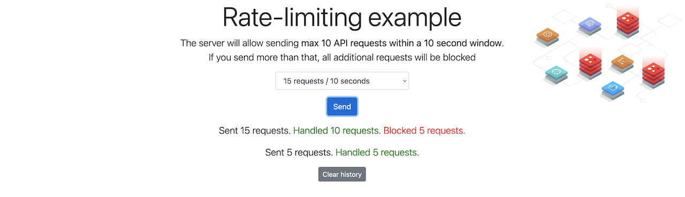

[[English](README.md)] [[한국어](README.ko.md)]

# Chaos Engineering
Chaos engineering is the discipline of experimenting on a distributed system in order to build confidence in the system's capability to withstand turbulent and unexpected conditions in production. If you want know why and how to do chaos engineering, please refer to this [page](https://github.com/Young-ook/terraform-aws-fis/blob/main/README.md).

## Download example
Download this example on your workspace
```sh
git clone https://github.com/Young-ook/terraform-aws-fis
cd terraform-aws-fis/examples/redis
```

## Setup
[This](https://github.com/Young-ook/terraform-aws-fis/blob/main/examples/redis/main.tf) is an example of terraform configuration file to create AWS Fault Injection Simulator experiments for chaos engineering. Check out and apply it using terraform command.

If you don't have the terraform tools in your environment, go to the main [page](https://github.com/Young-ook/terraform-aws-fis#terraform) of this repository and follow the installation instructions.

Run terraform:
```
terraform init
terraform apply
```
Also you can use the `-var-file` option for customized paramters when you run the terraform plan/apply command.
```
terraform plan -var-file fixture.tc1.tfvars
terraform apply -var-file fixture.tc1.tfvars
```

### Update kubeconfig
Update and download kubernetes config file to local. You can see the bash command like below after terraform apply is complete. The output looks like below. Copy and run it to save the kubernetes configuration file to your local workspace. And export it as an environment variable to apply to the terminal.
```
bash -e .terraform/modules/eks/script/update-kubeconfig.sh -r ap-northeast-2 -n fis-az -k kubeconfig
export KUBECONFIG=kubeconfig
```

### Application
For this lab, we picked up the Redis rate-limit application which is a simple application made by redis lab for learning and demonstration purposes.

### Build an application
Run a build job to create a redis client application container image. Copy the `build` command from the terraform output and run it:
```
bash -e .terraform/modules/ci/modules/codebuild/script/start-build.sh -r ap-northeast-2 -n arn:aws:codebuild:ap-northeast-2:111122223333:project/fis-az-cxblf
```

### Deploy application
Create the namespace and deploy application.
```
kubectl apply -f redispy/redispy.yaml
```
Verify that the pod came up fine (ensure nothing else is running on port 8080):
```
kubectl -n redispy get pod -l name=www
```
The output will be something like this:
```
NAME                   READY   STATUS    RESTARTS   AGE
www-59b86f6668-4sdr2   1/1     Running   0          43s
```

#### Local Workspace
In your local workspace, connect through a proxy to access your application's endpoint.
```
kubectl -n redispy port-forward svc/www 8080:8080
```
Open `http://localhost:8080` on your web browser. This shows the redis-rate-limit main page.

#### Cloud9
In your Cloud9 IDE, run the application.
```
kubectl -n redispy port-forward svc/www 8080:8080
```
Click `Preview` and `Preview Running Application`. This opens up a preview tab and shows the redis-rate-limit main page.



🎉 Congrats, you’ve deployed the sample application on your cluster.

## Run Fault Injection Experiments
This module automatically creates fault injection simulator experiment templates on your AWS account. Move to the AWS FIS service page on the AWS Management Console and select Experiment templates menu on the left. Then you will see the created experiment templates for chaos engineering. To test your environment, select a experiment template that you want to run and click the `Actions` button on the right top on the screen. You will see `Start experiment` in the middle of poped up menu and select it. And follow the instructions.


### AZ Outage
This test will inject network outage to a target availability zone (AZ).

#### Define Steady State
First of all, we need to define steady state of the service. This means the service is healthy and working well. Let’s go ahead and explore Redis-rate-limit application. Try out to select one of the requests-per-second (RPS) options and run it.

#### Hypothesis
Through this experiment, we will verify that the Redis cluster is only partially affected by single Availability Zone failure. The application we will use is a simple web application that applies throttling when it communications with a Redis cluster.  In order for chaos engineering to follow the scientific method, we need to start by making hypotheses. To help with this, you can use an experiment chart (see below) in your experiment design. We encourage you to take at least 5 minutes to write your experiment plan.

**Steady State Hypothesis Example**

+ Title: Services are all available and healthy
+ Type: What are your assumptions?
   - [ ] No Impact
   - [ ] Degraded Performance
   - [ ] Service Outage
   - [ ] Impproved Performance
+ Probes:
   - Type: CloudWatch Metric
   - Status: `p90`
+ Stop condition (Abort condition):
   - Type: CloudWatch Alarm
   - Status: `p90`
+ Results:
   - What did you see?
+ Conclusions:
   - [ ] Everything is as expected
   - [ ] Detected something
   - [ ] Handleable error has occurred
   - [ ] Need to automate
   - [ ] Need to dig deeper

#### Stop Condition
#### Run Experiment
Make sure that your Redis application is running on your EKS cluster. Go to the AWS FIS service page and select `AZOutage` from the list of experiment templates. Then use the *Actions* button to start the experiment. AWS FIS will start to block network traffics from and to a (randomly) selected availability zone soon. After then move to the Redis application and test. What did you see? Is your application working well? or broken?

#### Improvements

### Cluster Failover
#### Define Steady State
#### Hypothesis
#### Stop Condition
#### Run Experiment

#### Improvements

## Clean up
Delete all kubernetes resources:
```
kubectl delete -f redispy/redispy.yaml
```

Run terraform:
```
terraform destroy
```
Don't forget you have to use the `-var-file` option when you run terraform destroy command to delete the aws resources created with extra variable files.
```
terraform destroy -var-file fixture.tc1.tfvars
```

# Additional Resources
- [New cluster-mode support in redis-py](https://aws.amazon.com/blogs/opensource/new-cluster-mode-support-in-redis-py/)
