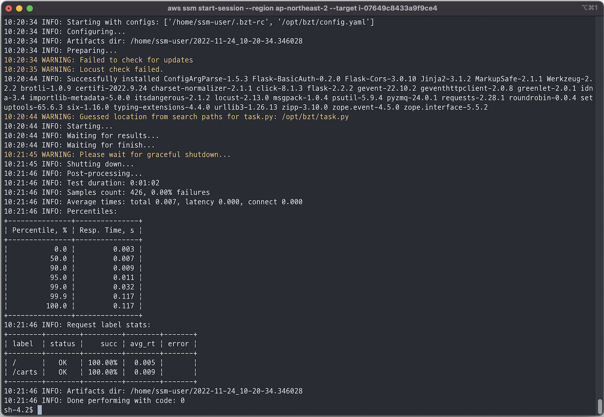

# Taurus by BlazeMeter
[Taurus](https://gettaurus.org/) is a integrated load testing tool that hides the complexity of performance and functional tests with an automation-friendly convenience wrapper. Taurus relies on JMeter, Gatling, Locust.io, and Selenium WebDriver as its underlying tools.

## Getting started
This module requires terraform tool version 0.13 or higher and AWS CLI. If you don't have thoes tools on your workspace, please follow the [Getting started](https://github.com/Young-ook/terraform-aws-fis#getting-started).

### Setup
Move to the your local workspace and prepare load testing configuration files. This is an example files (test.yaml, test.py) for load test suite configuration.

test.yaml
```
---
execution:
- executor: locust
  concurrency: 10
  ramp-up: 1m
  iterations: 1000
  scenario: hellotest

scenarios:
  hellotest:
    default-address: ${target}
    script: test.py                  # [Caution] Don't change the script file name. 
                                     # Test script will be saved as `test.py` automatically inside of bzt module.
```

test.py
```
from locust import HttpUser, TaskSet, task, between

class WebsiteTasks(TaskSet):
    @task
    def index(self):
        self.client.get("/")

    @task
    def about(self):
        self.client.get("/status")

class WebsiteUser(HttpUser):
    tasks = [WebsiteTasks]
    wait_time = between(0.100, 1.500)
```

Then create a new terraform file, (e.g., main.tf) and write code as below to use blaze meter module.

main.tf
```
module "bzt" {
  source  = "Young-ook/fis/aws//modules/bzt"
  config  = templatefile("${path.module}/test.yaml", { target = format("http://app.cluster.local" })
  task    = file("${path.module}/test.py")
}
```

Or, you can define test scenarios without external python script because LocustIO executor partially supports building scenario from requests. Supported features:
 - request methods GET/POST
 - headers and body for requests
 - set timeout/think-time on both scenario/request levels
 - assertions (for body and http-code)

test.yaml
```
---
execution:
- executor: locust
  concurrency: 10
  ramp-up: 1m
  iterations: 1000
  scenario: hellotest

scenarios:
  request_example:
    timeout: 10  #  global scenario timeout for connecting, receiving results, 30 seconds by default
    think-time: 1s500ms  # global scenario delay between each request
    default-address: ${target}  # specify a base address, so you can use short urls in requests
    keepalive: true  # flag to use HTTP keep-alive for connections, default is true
    requests:
    - url: /  
      method: get
      headers:
        var1: val1
      body: 'body content'
      assert:
      - contains:
        - body  # list of search patterns
        - content
        subject: body # subject for check
        regexp: false  # treat string as regular expression, true by default
        not: false  # inverse assertion condition
```

In this case, you don't need to set *task* variable in the bzt module.

main.tf
```
module "bzt" {
  source  = "Young-ook/fis/aws//modules/bzt"
  config  = templatefile("${path.module}/test.yaml", { target = format("http://app.cluster.local" })
}
```

Run terraform:
```
terraform init
terraform apply
```

### Connect
Move to the EC2 service page on the AWS Management Conosol and select Instances button on the left side menu. Find an instance that you launched. Select the instance and click *Connect* button on top of the window. After then you will see three tabs EC2 Instance Connect, Session Manager, SSH client. Select Session Manager tab and follow the instruction on the screen.

### Run Taurus
You can use `-h` option to display help message when you run `bzt` command.
```
bzt -h
Usage: bzt [options] [configs] [-aliases]

BlazeMeter Taurus Tool v1.16.18, the configuration-driven test running engine

Options:
  -h, --help            show this help message and exit
  -l LOG, --log=LOG     Log file location
  -o OPTION, --option=OPTION
                        Override option in config
  -q, --quiet           Only errors and warnings printed to console
  -v, --verbose         Prints all logging messages to console
  -n, --no-system-configs
                        Skip system and user config files
```



